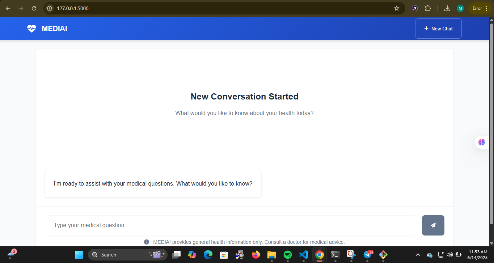

````markdown
# MEDIAI - AI Medical Assistant



MEDIAI is an AI-powered medical assistant web app that allows users to engage in natural medical conversations. It offers secure, responsive interactions and is powered by OpenAI’s GPT-4.

---

## 🚀 Features

- 💬 Natural medical conversations  
- 🏥 Professional response formatting  
- 🔄 Start new conversations  
- 💡 Suggested medical questions  
- 📱 Fully responsive design  
- 🔒 Secure session management  

---

## 🛠️ Technologies Used

- Python 3.9+  
- Flask 2.0  
- OpenAI GPT-4 API  
- HTML5 / CSS3 / JavaScript  

---

## ⚙️ Installation

### 1. Clone Repository
```bash
git clone https://github.com/abu-muhammedx7/MediAi-Presentation.git
cd mediai
````

### 2. Create Virtual Environment

```bash
python -m venv venv
source venv/bin/activate  # On Windows: venv\Scripts\activate
```

### 3. Install Dependencies

```bash
pip install -r requirements.txt
```

### 4. Configure Environment Variables

Create a `.env` file in the root directory:

```env
OPENAI_API_KEY=your_api_key
SECRET_KEY=your_secret_key
```

### 5. Run Application

```bash
python app.py
```

Visit: [http://localhost:5000](http://localhost:5000)

---

## 📁 Project Structure

```
mediai/
├── static/
│   ├── css/
│   │   └── style.css
│   ├── js/
│   │   └── script.js
│   └── img/
│       └── screenshot.png
├── templates/
│   ├── base.html
│   └── index.html
├── app.py
├── config.py
├── requirements.txt
└── .env
```

---

## 📄 License

This project is licensed under the MIT License. See the [LICENSE](LICENSE) file for details.

---

## ✨ Acknowledgements

* OpenAI for GPT-4
* Flask community
* Developers and testers of MEDIAI

---

> 🧠 *Disclaimer: This tool is for informational purposes only and is not a substitute for professional medical advice.*

```

